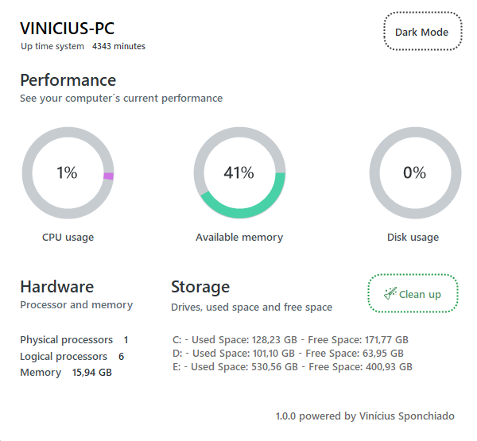

# VINfo - System Information Utility

VINfo is a user-friendly C# application designed to provide comprehensive system information, ensuring you stay informed about your computer's performance. Whether you need real-time data on CPU usage, memory status, disk space, or detailed hardware specifications, VINfo has got you covered. Additionally, VINfo offers essential maintenance tasks to keep your system running smoothly.

## Features
- **System Overview:**
  - CPU Usage
  - Free Memory (RAM)
  - Disk Space Usage
  
- **Hardware Specifications:**
  - Processor Details
  - Total Memory (RAM)
  
- **Disk Information:**
  - Used Space
  - Free Space
  
- **Maintenance Tasks:**
  - Clean Temporary Folder
  - Empty Recycle Bin
  
- **Customization:**
  - Toggle between Dark and Light Themes

## Screenshots
### Dark Theme

### Light Theme

---

Feel free to share your feedback, suggestions, and ideas. I am open to new features and contributions from the community to make VINfo even better. Let's work together to enhance the user experience and keep our systems running smoothly. 

*Designed and developed by Vinícius Henrique Sponchiado.*

